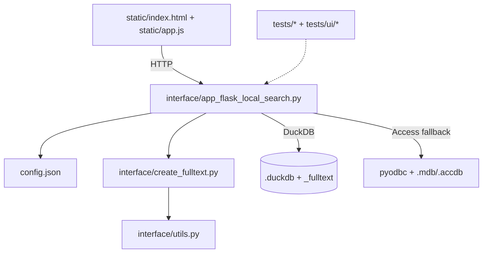

# Repo Map

Resumo tecnico e direto da estrutura, fluxos e responsabilidades do repositorio.

## Estrutura

- `main.py`: entrypoint para subir a interface Flask completa.
- `interface/`: backend Flask e utilitarios de indexacao e busca.
- `static/`: UI (HTML, JS, assets).
- `tests/`: testes Python e UI (Playwright).
- `tools/`: scripts auxiliares de analise e relatorios.
- `convert_*.py`: conversores Access -> DuckDB.

## Componentes principais

- `interface/app_flask_local_search.py`:
  - Endpoints admin: upload, select, delete, list, status, start_index, set_priority.
  - Busca: `/_fulltext` quando em DuckDB, fallback Access via ODBC quando aplicavel.
  - Config: le e grava `config.json`.
- `interface/create_fulltext.py`:
  - Cria ou retoma indice `_fulltext`.
  - Normaliza e serializa dados via `interface/utils.py`.
- `interface/check_progress.py`:
  - Diagnostico do progresso de indexacao.
- `static/index.html` + `static/app.js`:
  - Fluxo de UI e chamadas aos endpoints do backend.

## Conversao Access e modularidade (diretriz)

Objetivo: manter conversores isolados e orquestracao centralizada, com modo puro sem ODBC.

- `access_convert.py`:
  - Orquestrador unico de conversao Access -> DuckDB.
  - Deve selecionar estrategia por ordem e por flag (modo puro).
- `convert_pyaccess_parser.py`:
  - Metodo principal no modo puro (sem ODBC).
- `convert_pyodbc.py`:
  - Metodo preferencial no Windows quando ODBC estiver habilitado.

### Feature flags e settings

- `conversion_mode`:
  - `odbc_preferred`: tenta ODBC primeiro, fallback para metodo puro.
  - `pure_only`: desativa ODBC e usa somente metodo puro.
- `odbc_enabled`:
  - `true|false` para bloquear qualquer uso de ODBC via configuracao.
  - Afeta conversao, listagem de tabelas Access e fallback de busca.

### Fluxo de decisao (alto nivel)

```
if conversion_mode == "pure_only" or odbc_enabled == false:
    usar pyaccess_parser
else:
    tentar pyodbc
    se falhar -> pyaccess_parser
```

## Fluxos essenciais

- Upload e selecao:
  - UI envia arquivo -> backend grava e atualiza `config.json`.
- Conversao:
  - Para `.mdb/.accdb`, tenta converter para `.duckdb`.
- Indexacao:
  - Backend inicia `create_fulltext` quando solicitado ou configurado.
- Busca:
  - DuckDB: usa `_fulltext` + ranking.
  - Access: fallback com `pyodbc` e ranking em Python.

## Testes

- `tests/` (pytest + unittest): API e funcoes auxiliares.
- `tests/ui` (Playwright): smoke e fluxos basicos.

---

## Mapa em blocos (ASCII)

```
   [UI: static/*]
        |
        v
[Flask: app_flask_local_search.py]
   |        |        |
   |        |        +--> config.json (estado)
   |        |
   |        +--> create_fulltext.py (indexacao)
   |
   +--> duckdb / _fulltext / pyodbc
```

## Mapa em mermaid


